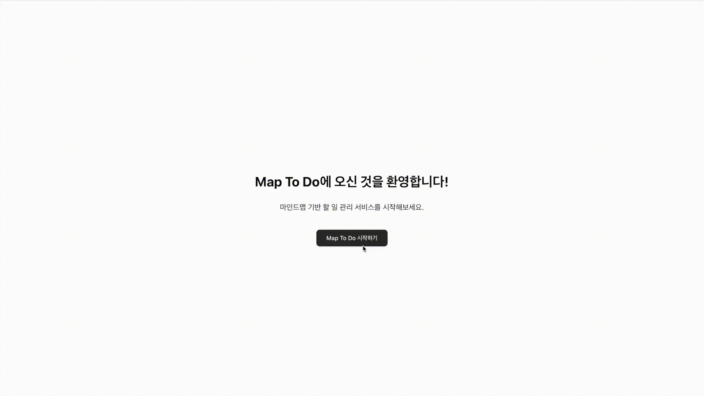

## 🛠️ 작업 내역 (2024-06-07)



**Demo:** https://map-to-do.vercel.app  
**Youtube:** https://youtu.be/RnU5Go1IeCk  

### 1. 프로젝트 리팩토링 및 구조 설계
- 기존 코드를 Next.js/React 구조에 맞게 리팩토링.
- 폴더 구조(components, app, types 등)와 역할 분리 적용.
- mindmap, todo 등 도메인별로 컴포넌트와 페이지 분리.
- app/page.tsx는 인트로, app/mindmap/page.tsx(→maptodo/page.tsx)는 실제 기능 페이지로 분리.

### 2. MapCanvas(마인드맵) 기능 구현
- React Flow 기반 마인드맵 편집 기능 구현.
- 노드 추가, 더블클릭 편집, Tab/Enter로 자식/형제 노드 생성, 방향키로 노드 선택 이동, 트리 레이아웃 등 다양한 UX 적용.
- 노드 추가 시 자동 선택, z-order 문제 해결, 노드 위치 위→아래로 생성되도록 개선.
- 초기 확대 비율 조정, shadcn/ui Button 컴포넌트로 버튼 스타일 통일.

### 3. MapList(맵 목록) 기능 구현
- 좌측 패널에 맵 목록, 선택, 새 맵 생성(New Map) 기능 구현.
- 맵 선택/생성 시 중앙 MapCanvas와 상태 연동.
- 루트노드 텍스트 변경 시 맵 목록의 제목도 실시간 반영.

### 4. 데이터 관리 및 저장
- maps 상태가 바뀔 때마다 localStorage에 저장/불러오기 적용.
- MapCanvas에서 노드/엣지 변경 시 maps 상태에 반영되도록 onChange 구현.

### 5. ToDo Export & TodoList 기능
- ToDo Export 버튼 클릭 시, 마인드맵의 리프노드를 ToDo로 변환(부모 label은 그룹, 본인 label은 텍스트).
- TodoList(우측 패널)에서 그룹별로 ToDo 항목 표시, 상단에 맵 제목 표시.
- ToDo 항목에 체크박스 추가, 체크 시 완료(취소선) 처리.

### 6. 추가 UX/기능 논의
- 점 표시 토글 삭제, 버튼 스타일 개선, shadcn/ui 컴포넌트 적극 활용.
- 들여쓰기(인덴트) 등 레벨2 이상 노드의 시각적 구분 요청(아직 미완료).
- 우선순위/긴급도 등은 추후 구현 예정.

### 7. 진행 방식
- 각 단계별로 설계→구현→테스트→피드백 반영을 반복.
- 사용자의 구체적 요구(UX, 데이터 흐름, UI 스타일 등)에 맞춰 실시간으로 구조/코드 개선.

**결론:**
마인드맵 기반 ToDo 관리 MVP를 Next.js/React/shadcn 구조로 설계 및 구현. MapList, MapCanvas, TodoList의 상태/데이터/UX를 단계별로 개선하며, 실제 사용 흐름에 맞는 기능을 하나씩 완성해가는 과정을 진행함.

---

## 📁 프로젝트 폴더 구조 및 역할

```
app/
  mindmap/         # 마인드맵 기능 페이지
    page.tsx
  todo/            # ToDo 리스트 페이지
    page.tsx
  layout.tsx       # 전체 레이아웃 및 공통 스타일
  globals.css      # 전역 스타일

components/
  mindmap/         # 마인드맵 관련 컴포넌트
    MindMap.tsx
    MindMapNode.tsx
    MindMapApp.tsx
  todo/            # ToDo 관련 컴포넌트
    TodoList.tsx
  ui/              # 공통 UI 컴포넌트(shadcn 기반)
    button.tsx
    input.tsx
    ...

lib/
  utils.ts         # 유틸리티 함수
  api.ts           # 데이터 처리/저장 관련 함수

types/
  mindmap.ts       # 마인드맵 타입 정의
  todo.ts          # ToDo 타입 정의

public/            # 정적 파일(이미지, 폰트 등)

_doc/              # 프로젝트 문서 및 참고자료
  PRD.md           # 요구사항 명세
  ToDo.md          # 작업 내역 등

```

- `app/`: Next.js의 페이지 라우팅 및 레이아웃 관리
- `components/`: UI 및 도메인별(마인드맵, ToDo 등) 컴포넌트 모음
- `lib/`: 비즈니스 로직, 유틸리티, API 함수 등
- `types/`: 타입스크립트 타입 정의
- `public/`: 정적 리소스(이미지, 폰트 등)
- `_doc/`: PRD, 작업 내역 등 문서화 자료

---
